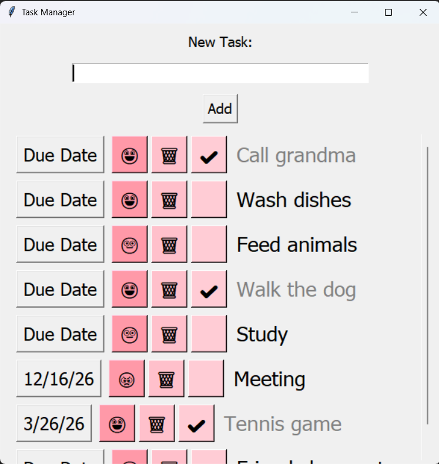
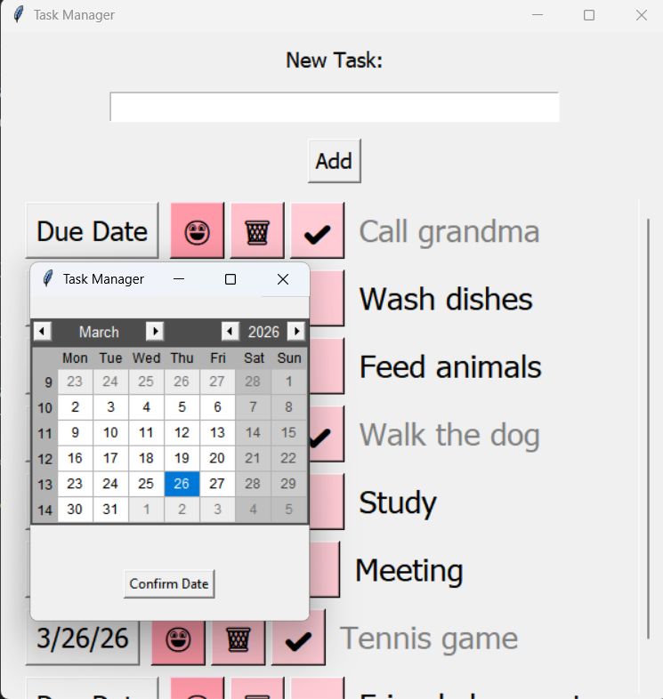

# Task Manager - To-Do List Application

A simple and intuitive to-do list application built with Python and Tkinter. Organize your tasks with due dates, urgency indicators, and completion tracking.

## Features

- ✅ **Create Tasks** - Add new tasks with a simple input field
- 📅 **Due Dates** - Set due dates for each task using an interactive calendar
- ⚠️ **Urgency Levels** - Mark tasks with three urgency levels (😃 Not Urgent, 😐 Neutral, 😠 Urgent)
- ✔️ **Task Completion** - Check off completed tasks (completed tasks appear grayed out)
- 🗑️ **Delete Tasks** - Remove tasks you no longer need
- 💾 **Data Persistence** - All tasks are automatically saved to a JSON file, so they persist between sessions
- 📜 **Scrollable Interface** - Handle large task lists with an integrated scrollbar

## Screenshots



## Requirements

- Python 3.x
- tkinter (usually comes with Python)
- tkcalendar

## Installation

1. **Clone or download this project**

2. **Install required dependencies:**
```bash
pip install tkcalendar
```


## How to Run

1. **Navigate to the project directory:**
```bash
cd path/to/to_do_list
```


2. **Run the application:**
```bash
python to_do_list.py
```


The application window will open, and your previously saved tasks will automatically load.

## How to Use

### Adding a Task
1. Type your task description in the "New Task:" input field
2. Click the "Add" button
3. Your task appears in the list below

### Setting a Due Date
1. Click the "Due Date" button on any task
2. A calendar window will open
3. Select your desired date
4. Click "Confirm Date"

### Marking Urgency
- Click the emoji button (😃, 😐, 😠) on a task to cycle through urgency levels
- Changes save automatically

### Completing a Task
- Click the checkbox button on a task to mark it complete
- Completed tasks appear in gray with a checkmark (✔️)

### Deleting a Task
- Click the trash can button (🗑️) to permanently delete a task

## Data Storage

All your tasks are automatically saved to a `tasks.json` file in the same directory as the application. This means:
- Tasks persist even after closing the application
- All changes (new tasks, deletions, date changes) are saved immediately
- No manual saving required

## File Structure
```text
to_do_list/
├── to_do_list.py          # Main application file
├── tasks.json             # Auto-generated file storing your tasks
└── README.md              # This file
```

## Technical Details

### Classes

**Task Class**
- Manages individual task data and UI elements
- Handles user interactions (check, delete, change icon, set date)
- Automatically saves changes to JSON

**TodoApp Class**
- Manages the main application window
- Handles task list display and scrolling
- Manages data persistence (save/load)

### How Data Persistence Works

The application uses JSON (JavaScript Object Notation) to store task data. Each task stores:
- Task text (description)
- Due date
- Completion status (checked or unchecked)
- Urgency level (icon index)

All tasks are saved immediately to tasks.json. When you reopen the app, all tasks are automatically restored.

## Troubleshooting

**Issue: "ModuleNotFoundError: No module named 'tkcalendar'"**
- Solution: Run `pip install tkcalendar`

**Issue: Tasks not saving**
- Check that you have write permissions in the folder where the script is located
- Ensure `tasks.json` file is not read-only

**Issue: Calendar window won't open**
- Only one calendar can be open at a time. Close the current calendar before opening another

## Future Enhancements

Possible improvements for future versions:
- Task categories/tags
- Task priorities with sorting
- Search functionality
- Dark mode
- Task descriptions/notes
- Recurring tasks

## License

This project is licensed under the MIT License - see the LICENSE file for details.

## Author

Created as a school project - 2026
